# igraph包的使用

## igraph包简介

`igraph`包是R语言中用于网络分析和图操作的强大工具。它提供了丰富的函数库，支持创建、操作、可视化和分析图结构。这一部分的教程将简单介绍`igraph`中一些重要的函数和操作。关于`igraph`的更多详细内容可以阅读该包的帮助文档或者访问`igraph`主页r.igraph.org。

在开始之前请先安装并导入`igraph`。


```r
#install.packages("igraph")
library('igraph')
#> 
#> Attaching package: 'igraph'
#> The following objects are masked from 'package:stats':
#> 
#>     decompose, spectrum
#> The following object is masked from 'package:base':
#> 
#>     union
```

## 创建igraph对象

`igraph`提供了很多创建图（igraph对象）的方法，下面列举几种常见的创建图的方法。

### 从边列表创建

创建igraph对象最常用的方法是`make_graph()`，它会根据指定的边构建一个网络。 例如，要创建一个有8个结点（编号为1至8）以及连接结点1-2、2-3、3-4三条边的有向图：


```r
edges <- c(1, 2, 2, 3, 3, 4)
g <- make_graph(edges, n = 8, directed = TRUE)
```

查看这个网络


```r
g
#> IGRAPH e07cecd D--- 8 3 -- 
#> + edges from e07cecd:
#> [1] 1->2 2->3 3->4
```

### 从邻接矩阵创建

另外一种比较常用的创建igraph对象的方法是从邻接矩阵创建。在心理学研究中，邻接矩阵往往相对容易获得，例如我们可以使用各种估计方法（如`qgraph`中的`EBICglasso`）获得变量之间的相关系数矩阵，这个相关系数矩阵就可以作为邻接矩阵创建我们的图。

这个邻接矩阵可以表示无权图：


```r
adjacent_matrix <- matrix(sample(0:1, 100, replace = TRUE, prob = c(0.9, 0.1)), ncol = 10)
g <- graph_from_adjacency_matrix(adjacent_matrix)
g
#> IGRAPH e084191 D--- 10 5 -- 
#> + edges from e084191:
#> [1] 1->5 1->8 3->2 5->6 6->7
```

也可以表示有权图：


```r
adjacent_matrix <- matrix(sample(0:5, 100, replace = TRUE, prob = c(0.9, 0.02, 0.02, 0.02, 0.02, 0.02)), ncol = 10)
g <- graph_from_adjacency_matrix(adjacent_matrix, weighted = TRUE)
g
#> IGRAPH e087c5b D-W- 10 8 -- 
#> + attr: weight (e/n)
#> + edges from e087c5b:
#> [1] 1->4 1->8 4->6 6->5 6->8 7->6 7->8 9->3
```

### 生成随机网络

`igraph`为我们提供了一系列生成随机图的方法，这些函数一般是`sample_()`。例如，我们可以使用`sample_smallworld()`生成一个Watts-Strogatz小世界网络。


```r
g <- sample_smallworld(1, 50, 5, 0.05)
plot(g)
```


:::{.rmdnote}
Watts-Strogatz小世界网络是一种特殊的复杂网络模型，由Duncan J. Watts和Steven Strogatz在1998年提出。这种网络模型结合了规则网络和随机网络的特性，具有高集聚系数（节点的邻居之间也有较高的连接概率，形成“团簇”）和短平均路径长度（尽管大部分节点彼此不直接相连，但通过少数几步就可以到达），能够很好地解释许多现实世界中的网络现象，如社交网络的“六度分隔”现象等。
:::

## 网络可视化

对于一个igraph对象，我们可以直接使用`plot()`绘制。例如，我们可以创建一个20世纪70年代美国一所大学空手道俱乐部34名成员之间的社交网络^[Zachary, W. W. (1977). An Information Flow Model for Conflict and Fission in Small Groups. *Journal of Anthropological Research*, *33*(4), 452–473.]。


```r
zachary_graph <- make_graph('Zachary')
plot(zachary_graph)
```

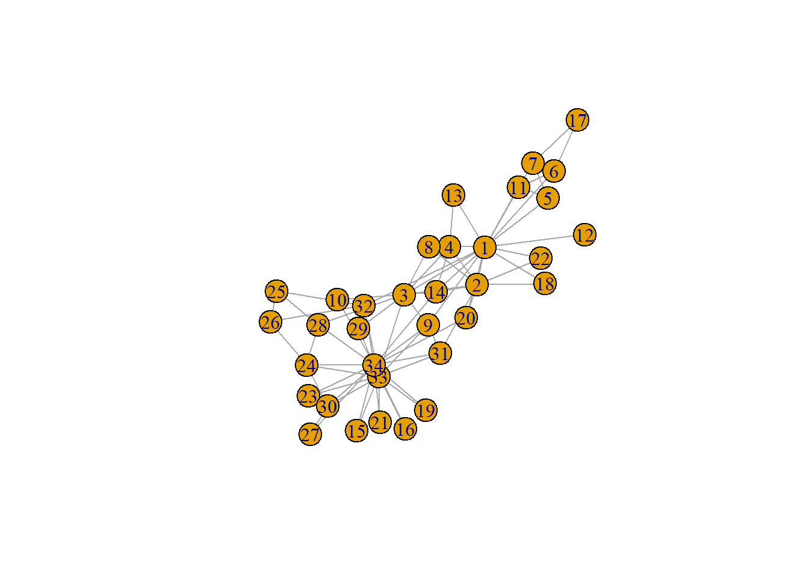

当然，这只是最最简单的可视化方法，为了得到更加美观和有意义的可视化图形，我们可以采用很多方法。

### 布局算法

图是一个抽象的数学对象，在二维、三维或任何其他几何空间中都没有特定的表示形式。 这就意味着，无论何时我们想将图形可视化，都必须先找到二维或三维空间中顶点到坐标的映射。图论的一个独立分支，即图绘制，试图通过多种图布局算法来解决这个问题。`igraph`实现了很多布局算法，还能将它们绘制到屏幕上或R本身支持的任何输出格式。

一种常见的布局是把所有结点放在在一个圆环上，可以使用`layout_in_circle`获得布局，这里得到的是一个N行2列的矩阵，代表了每个结点在二维空间中的坐标。


```r
circle_layout <- layout_in_circle(zachary_graph)
plot(zachary_graph, layout = circle_layout, main = "Zachary Social network with circle layout")
```

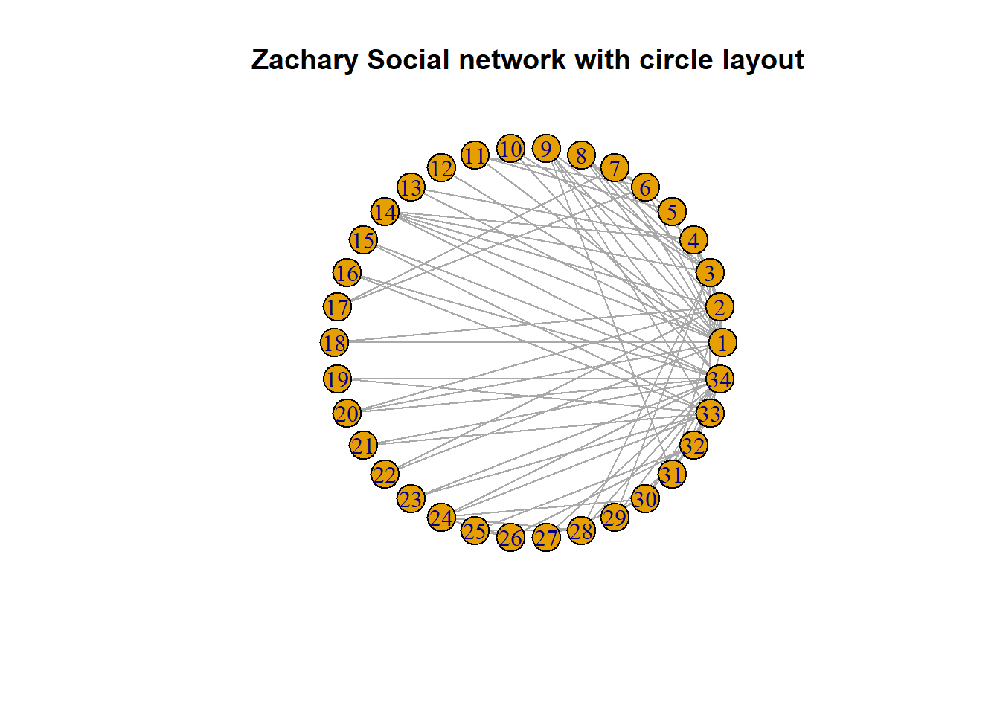

当然，除了直接得到一个单独的布局的矩阵，我们也可以直接在`plot`中设置`layout`参数时指定布局算法。例如，我们可以采用Kamada-Kawai算法设计布局。Kamada-Kawai算法是一种用于图布局的力引导算法，旨在将图中的节点在二维或三维空间中进行美观的布局。该算法通过模拟物理系统中的弹簧力并使系统总能量最小化来实现节点的优化排列。如果不指定布局的话，默认采用Fruchterman-Reingold算法，这也是一种常用的力引导布局算法，该算法也基于物理模拟的思想，将结点视为带电粒子，通过斥力和引力的相互作用来调整节点的位置。


```r
plot(zachary_graph, layout = layout_with_kk, main = "Zachary Social network with the Kamada-Kawai layout algorithm")
```

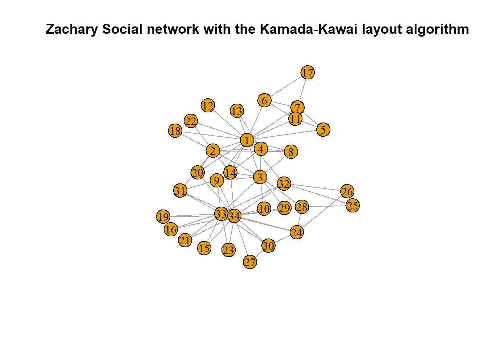

除了这些`igraph`还提供了多种布局算法，详情可以访问`igraph`主页的相关介绍 https://r.igraph.org/articles/igraph.html#layout-algorithms。

### 自定义绘图

除了布局算法，和R中的其他绘图工具一样，在使用`plot`绘制`igraph`对象时，我们可以通过多种参数进行自定义绘图，我们可以改变结点和边的大小、颜色等等。

对于这些方法，`igraph`主页 https://r.igraph.org/articles/igraph.html#layouts-and-plotting 有详细介绍，这里不再赘述。

## 图的基本操作

### 边和结点的添加与删除

在`igraph`中，我们还可以对图进行操作，例如添加结点或边：


```r
zachary_graph <- add_vertices(zachary_graph, 3)
zachary_graph <- add_edges(zachary_graph, edges = c(1, 35, 1, 36, 34, 37))
plot(zachary_graph)
```

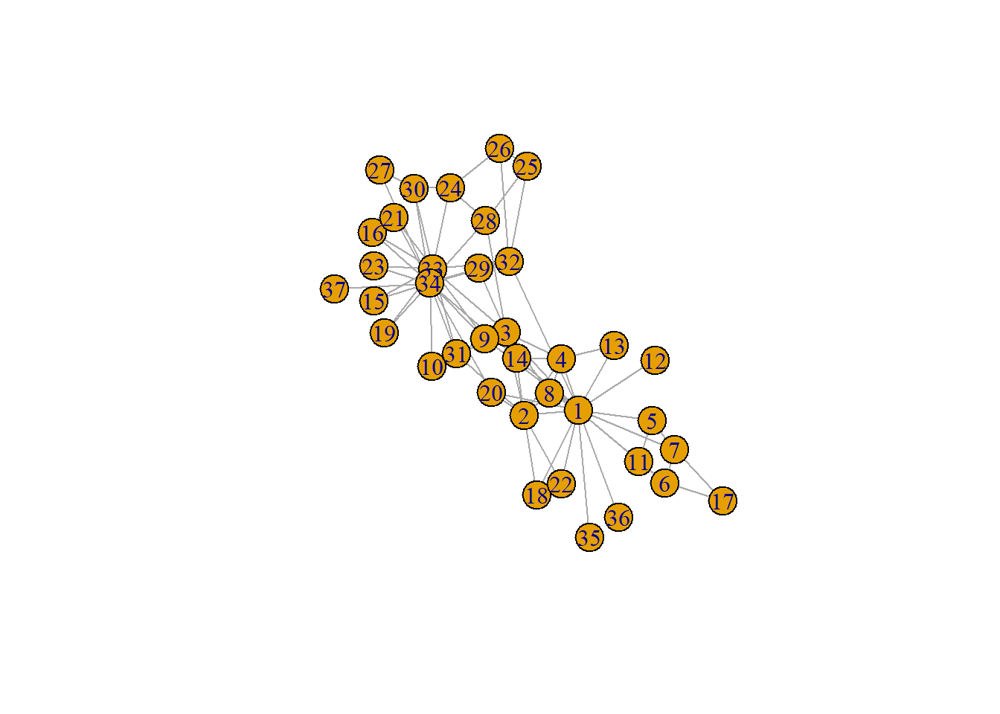

我们也可以删除边和结点。例如，我们想删除1和34之间的边可以这样操作：


```r
edge_id_to_delete <- get.edge.ids(zachary_graph, c(1, 35))
edge_id_to_delete
#> [1] 79

zachary_graph <- delete_edges(zachary_graph, edge_id_to_delete)
```

### 获得和修改结点和边的属性

在`igraph`中，我们可以获得和修改图的边和结点属性。现在我们采用`igraph`主页的示例生成一个简单的社交网络。


```r
social_network <- make_graph(
  ~ Alice - Boris:Himari:Moshe, Himari - Alice:Nang:Moshe:Samira,
  Ibrahim - Nang:Moshe, Nang - Samira
)
plot(social_network)
```

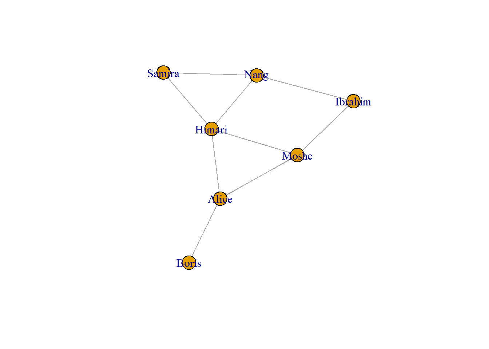

我们可以使用`V()`函数获得和修改结点属性。在这个网络中每个结点就是一个人，我们可以添加他们的年龄、性别等属性。同样，我们可以为网络中的边，也就是这些人之间的关系添加属性，比如这个关系是否正式。


```r
V(social_network)$age <- c(25, 31, 18, 23, 47, 22, 50)
V(social_network)$gender <- c("f", "m", "f", "m", "m", "f", "m")
E(social_network)$is_formal <- c(FALSE, FALSE, TRUE, TRUE, TRUE, FALSE, TRUE, FALSE, FALSE)
social_network
#> IGRAPH e0d0168 UN-- 7 9 -- 
#> + attr: name (v/c), age (v/n), gender (v/c),
#> | is_formal (e/l)
#> + edges from e0d0168 (vertex names):
#> [1] Alice --Boris   Alice --Himari  Alice --Moshe  
#> [4] Himari--Moshe   Himari--Nang    Himari--Samira 
#> [7] Moshe --Ibrahim Nang  --Samira  Nang  --Ibrahim
```

我们也可以用`set_vertex_attr()`和`set_edge_attr()`函数，道理是一样的。

## 图的基本分析

### 中心性指标

对于刚才的这个社交网络，我们可以计算每个结点的度。


```r
degree(social_network, mode = "all")
#>   Alice   Boris  Himari   Moshe    Nang  Samira Ibrahim 
#>       3       1       4       3       3       2       2
```

由于这个网络是一个无向图，因此不区分入度和出度。对于一个有向图，可以通过设置`mode`参数为`"in"`和`"out"`分别计算入度和出度。

同样，我们可以计算每个结点的接近中心性（closeness centrality）、中介中心性（betweenness centrality）和特征向量中心性（eigenvector centrality）。


```r
betweenness(social_network)
#>   Alice   Boris  Himari   Moshe    Nang  Samira Ibrahim 
#>     5.0     0.0     5.5     2.5     1.5     0.0     0.5
closeness(social_network)
#>      Alice      Boris     Himari      Moshe       Nang 
#> 0.11111111 0.07142857 0.12500000 0.11111111 0.10000000 
#>     Samira    Ibrahim 
#> 0.09090909 0.09090909
eigen_centrality(social_network)
#> $vector
#>     Alice     Boris    Himari     Moshe      Nang    Samira 
#> 0.7111995 0.2486011 1.0000000 0.7860027 0.7513989 0.6122047 
#>   Ibrahim 
#> 0.5374016 
#> 
#> $value
#> [1] 2.860806
#> 
#> $options
#> $options$bmat
#> [1] "I"
#> 
#> $options$n
#> [1] 7
#> 
#> $options$which
#> [1] "LA"
#> 
#> $options$nev
#> [1] 1
#> 
#> $options$tol
#> [1] 0
#> 
#> $options$ncv
#> [1] 0
#> 
#> $options$ldv
#> [1] 0
#> 
#> $options$ishift
#> [1] 1
#> 
#> $options$maxiter
#> [1] 3000
#> 
#> $options$nb
#> [1] 1
#> 
#> $options$mode
#> [1] 1
#> 
#> $options$start
#> [1] 1
#> 
#> $options$sigma
#> [1] 0
#> 
#> $options$sigmai
#> [1] 0
#> 
#> $options$info
#> [1] 0
#> 
#> $options$iter
#> [1] 23
#> 
#> $options$nconv
#> [1] 1
#> 
#> $options$numop
#> [1] 25
#> 
#> $options$numopb
#> [1] 0
#> 
#> $options$numreo
#> [1] 4
```

除了这些中心性指标，`igraph`还有其他度量方法。

### 路径与距离

我们可以使用`shortest_paths()`计算结点之间的最短路径。


```r
shortest_paths(social_network, "Alice", "Nang")
#> $vpath
#> $vpath[[1]]
#> + 3/7 vertices, named, from e0d0168:
#> [1] Alice  Himari Nang  
#> 
#> 
#> $epath
#> NULL
#> 
#> $predecessors
#> NULL
#> 
#> $inbound_edges
#> NULL
```

我们也可以用`distances()`计算结点之间的距离矩阵。


```r
distances(social_network)
#>         Alice Boris Himari Moshe Nang Samira Ibrahim
#> Alice       0     1      1     1    2      2       2
#> Boris       1     0      2     2    3      3       3
#> Himari      1     2      0     1    1      1       2
#> Moshe       1     2      1     0    2      2       1
#> Nang        2     3      1     2    0      1       1
#> Samira      2     3      1     2    1      0       2
#> Ibrahim     2     3      2     1    1      2       0
```

### 连通性

在`igraph`中，我们也可以计算图的连通性和连通分量。我们可以首先生成一个随机的图。


```r
adjacent_matrix <- matrix(sample(0:1, 100, replace = TRUE, prob = c(0.9, 0.1)), ncol = 10)
g <- graph_from_adjacency_matrix(adjacent_matrix)
plot(g)
```

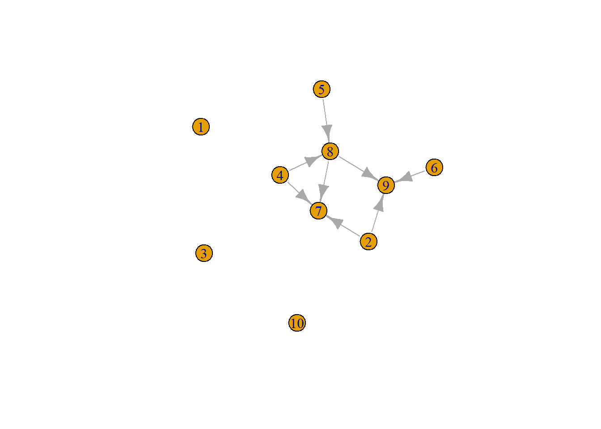

这个图显然是不连通的。我们可以用`is_connected`检查一个图是否连通。


```r
is_connected(g)
#> [1] FALSE
```

我们可以用`components()`计算连通分量。


```r
components(g)
#> $membership
#>  [1] 1 2 3 2 2 2 2 2 2 4
#> 
#> $csize
#> [1] 1 7 1 1
#> 
#> $no
#> [1] 4
```

## 社区检测

社区检测（Community Detection）是网络分析中的一种技术，用于识别网络中节点的聚集行为，即将网络划分为若干个社区或聚类，有时社区检测也称为聚类（clustering），但不同于一般意义上的聚类。社区内的结点彼此之间连接紧密，而社区之间的结点连接相对稀疏。社区检测在心理学的网络分析中应用十分广泛，例如，我们可以对症状网络进行社区检测，研究各种精神障碍之间的共病关系。

### 聚类系数

传递性（transitivity）又称聚类系数（clustering coefficient）， 测量的是一个结点的相邻顶点结点的概率。聚类系数包括两类：结点水平的局部聚类系数和网络水平的全局聚类系数。对于有权图的聚类系数有几种描述，这里我们使用A. Barrat的定义^[Alain Barrat, Marc Barthelemy, Romualdo Pastor-Satorras, Alessandro Vespignani: The architecture of complex weighted networks, Proc. Natl. Acad. Sci. USA 101, 3747 (2004)]，这是一个结点水平的局部聚类系数，其公式为

$$
C_i^w = \frac{1}{s_i(k_i-1)}\sum_{j,h}\frac{w_{ij}+w_{ih}}{2}a_{ij}a_{ih}a_{jh}
$$

其中，$s_i$指结点$i$的强度（该结点相连边权重之和），$a_{ij}$是邻接矩阵中的元素，$k_i$指结点$i$的度，$w_{ij}$为边权重。

在`igraph`中可以使用`transitivity()`计算。以一个随机生成的小世界网络为例。


```r
g <- sample_smallworld(1, 50, 5, 0.05)
transitivity(g)
#> [1] 0.4940555
```

### 边中介（Edge Betweenness）算法

边中介（Edge Betweenness）算法通过计算每条边在网络中作为桥梁的程度来识别社区。该算法基于中介中心性（Edge Betweenness Centrality），即一条边在所有最短路径中出现的频率。算法通过迭代删除中介中心性最高的边，逐步将网络分割成多个子图。每次删除一条边后，重新计算剩余边的中介中心性，直到网络被分割成若干个社区。该算法适用于小规模网络，因为大规模网络所需计算资源较高。


```r
cluster_edge_betweenness(g)
#> IGRAPH clustering edge betweenness, groups: 4, mod: 0.45
#> + groups:
#>   $`1`
#>    [1]  1  2  3  4  5  6  7  8  9 10 49 50
#>   
#>   $`2`
#>   [1] 11 12 13 14 15 16 17 18 19
#>   
#>   $`3`
#>    [1] 20 21 22 23 24 25 26 27 28 29 30 31 32 33 34
#>   
#>   $`4`
#>   + ... omitted several groups/vertices
plot(g, 
     layout = layout,
     vertex.color = cluster_edge_betweenness(g)$membership)
```

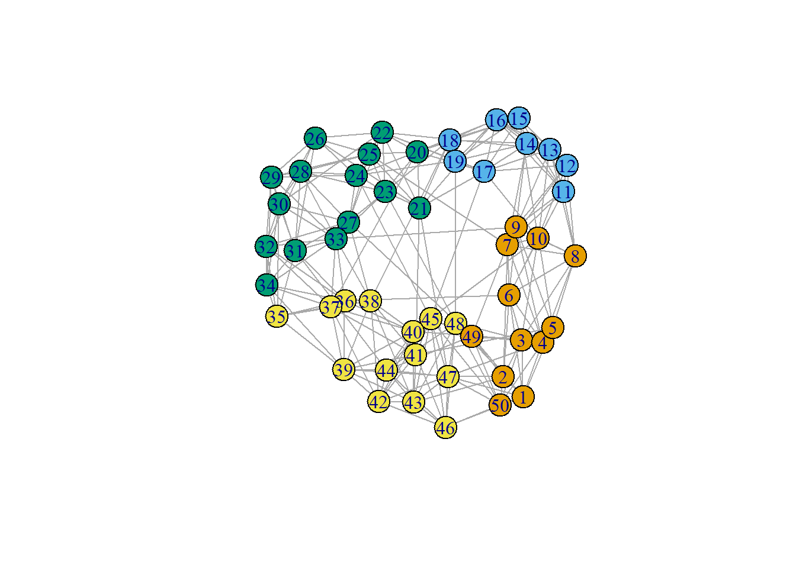

### 标签传播（Label Propagation）算法

标签传播（Label Propagation）算法是一种用于检测网络中社区结构的快速、近乎线性时间复杂度的算法。它的工作原理是给结点贴上唯一的标签，然后通过结点附近的多数投票来更新标签。适用于大规模网络，计算速度快。


```r
cluster_label_prop(g)
#> IGRAPH clustering label propagation, groups: 3, mod: 0.44
#> + groups:
#>   $`1`
#>    [1]  1  2  3 35 36 37 38 39 40 41 42 43 44 45 46 47 48 49
#>   [19] 50
#>   
#>   $`2`
#>    [1]  4  5  6  7  8  9 10 11 12 13 14 15 16 17 18 19
#>   
#>   $`3`
#>    [1] 20 21 22 23 24 25 26 27 28 29 30 31 32 33 34
#> 
plot(g, 
     layout = layout,
     vertex.color = cluster_label_prop(g)$membership)
```

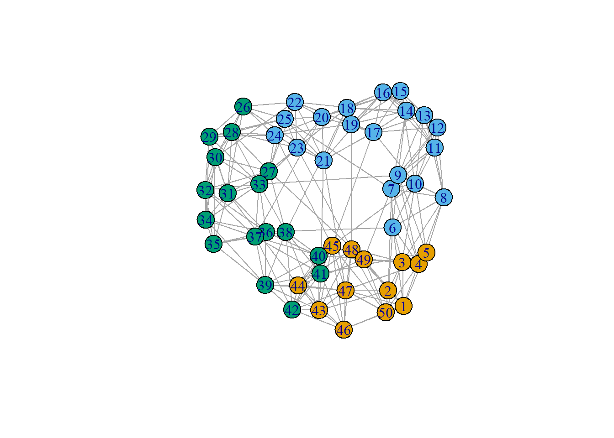

### Louvain算法

Louvain算法是一种基于模块度（modularity）优化的社区检测算法，广泛应用于大规模网络的社区发现。该算法由Vincent Blondel等人于2008年提出，旨在通过多层次的优化过程，快速、准确地识别网络中的社区结构。

Louvain算法的核心思想是通过最大化模块度来识别社区。模块度是衡量社区划分质量的指标，表示社区内结点之间的连接密度与随机情况下的连接密度之差。算法开始时，每个结点都会被单独分配到一个社区。在每一步中，结点都会以一种局部的、贪心的方式被重新分配到社区中：每个结点都会被移动到对模块化程度贡献最大的社区中。当没有结点可以重新分配时，每个社区就会被视为一个单独的结点，然后再从合并后的社区开始重新分配。当只剩下一个结点或模块度无法再增加时，该过程就会停止。自igraph 1.3版本起，结点将以随机顺序处理，因此算法结果可能不稳定。


```r
cluster_louvain(g)
#> IGRAPH clustering multi level, groups: 4, mod: 0.45
#> + groups:
#>   $`1`
#>    [1]  1  2  3  4  5  6  7  8  9 10 11 48 49 50
#>   
#>   $`2`
#>   [1] 12 13 14 15 16 17 18 19
#>   
#>   $`3`
#>    [1] 20 21 22 23 24 25 26 27 28 29 30 31 32 33 34 35 36 37
#>   
#>   $`4`
#>   + ... omitted several groups/vertices
plot(g, 
     layout = layout,
     vertex.color = cluster_louvain(g)$membership)
```

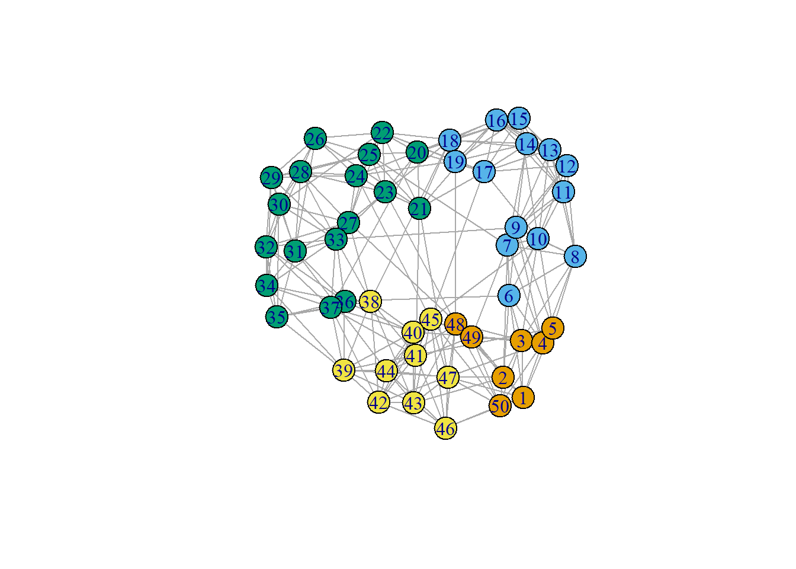

### 随机游走（Walktrap）算法

随机游走（Walktrap）算法是一种基于随机游走的社区检测算法，通过模拟随机游走来测量节点之间的相似性，其思想是短程随机游走往往会停留在同一个社区中。


```r
cluster_walktrap(g)
#> IGRAPH clustering walktrap, groups: 3, mod: 0.45
#> + groups:
#>   $`1`
#>    [1]  1  2  3  4  5  6 39 40 41 42 43 44 45 46 47 48 49 50
#>   
#>   $`2`
#>    [1] 20 21 22 23 24 25 26 27 28 29 30 31 32 33 34 35 36 37
#>   [19] 38
#>   
#>   $`3`
#>    [1]  7  8  9 10 11 12 13 14 15 16 17 18 19
#> 
plot(g, 
     layout = layout,
     vertex.color = cluster_walktrap(g)$membership)
```

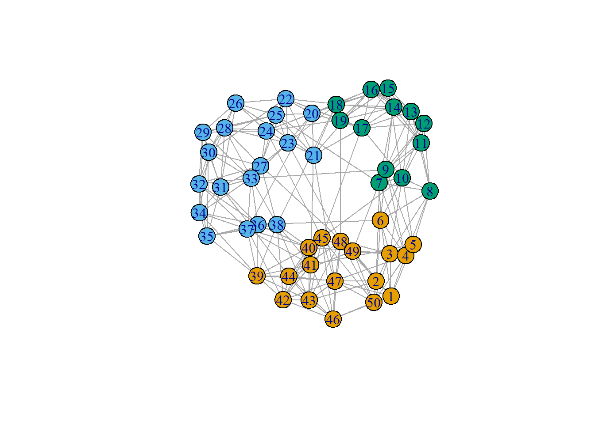

### 信息映射（Infomap）算法

信息映射（Infomap）算法是一种基于信息论的社区检测算法，通过最小化随机游走的预期描述长度来识别网络中的社区结构。


```r
cluster_infomap(g)
#> IGRAPH clustering infomap, groups: 3, mod: 0.46
#> + groups:
#>   $`1`
#>    [1]  1  2  3  4  5 38 39 40 41 42 43 44 45 46 47 48 49 50
#>   
#>   $`2`
#>    [1]  6  7  8  9 10 11 12 13 14 15 16 17 18 19
#>   
#>   $`3`
#>    [1] 20 21 22 23 24 25 26 27 28 29 30 31 32 33 34 35 36 37
#> 
plot(g, 
     layout = layout,
     vertex.color = cluster_infomap(g)$membership)
```


### 自旋玻璃（Spinglass）算法

自旋玻璃（Spinglass）算法是一种基于物理学中自旋玻璃模型的社区检测算法。该算法通过模拟自旋玻璃系统中的能量最小化过程，将网络中的结点划分为不同的社区，以最大化社区内部的连接强度。这种算法能够处理带有权重和方向的复杂网络（甚至是负权重）。


```r
cluster_spinglass(g)
#> IGRAPH clustering spinglass, groups: 4, mod: 0.46
#> + groups:
#>   $`1`
#>    [1]  1  2  3  4  5 41 42 43 44 45 46 47 48 49 50
#>   
#>   $`2`
#>   [1] 32 33 34 35 36 37 38 39 40
#>   
#>   $`3`
#>    [1]  6  7  8  9 10 11 12 13 14 15 16 17 18 19
#>   
#>   $`4`
#>   + ... omitted several groups/vertices
plot(g, 
     layout = layout,
     vertex.color = cluster_spinglass(g)$membership)
```

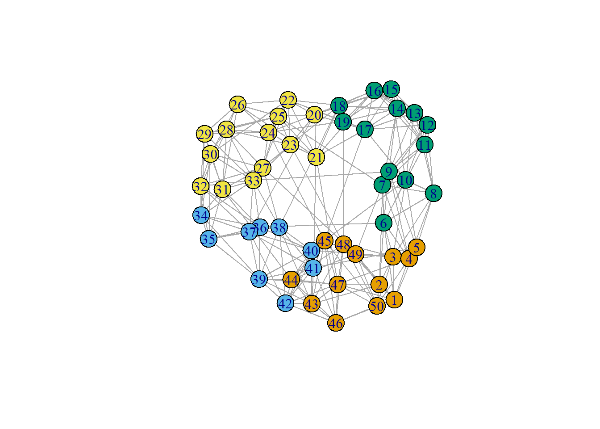

除了以上介绍的几种算法，`igraph`还提供了其他算法，如特征向量（Leading Eigenvector）算法等，可以根据实际研究的需要选择。
